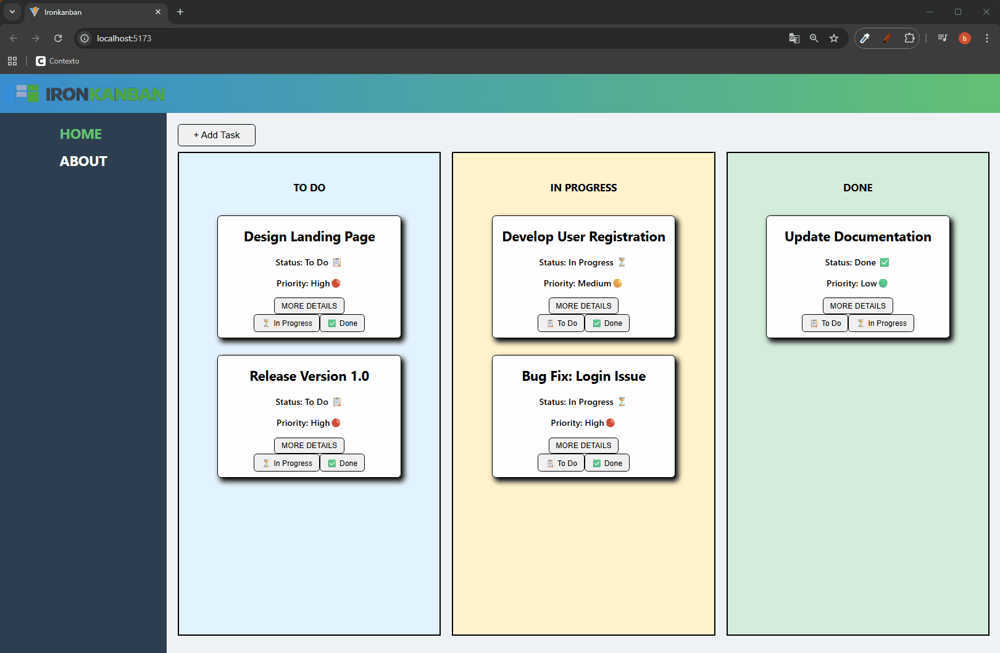

# KANBAN

This project is a **web-based task management application** using the **Kanban method**, which allows users to organize work into different stages to improve productivity and task tracking.

## 🚀 Features

- Create new tasks
- View existing tasks
- Organize tasks according to their status
- View the details of each task

The application is developed using **React** for the interface and follows a **component-based structure** to facilitate code reuse and maintenance.

---

## 🎯 Project Goal

The goal of this project is to practice and demonstrate knowledge in:

- React
- Reusable components
- State management
- React Router
- Dynamic list rendering
- Event handling

---

## 🛠 Technologies Used

- React
- JavaScript (ES6)
- HTML5
- CSS3
- React Router

---

## 👨‍💻 Author

**Bryan Santiago Paucarima Franco**  
Frontend Developer

- GitHub: [bryanpf93](https://github.com/bryanpf93)
- LinkedIn: [Bryan Santiago Paucarima Franco](https://www.linkedin.com/in/bryanpf93/)